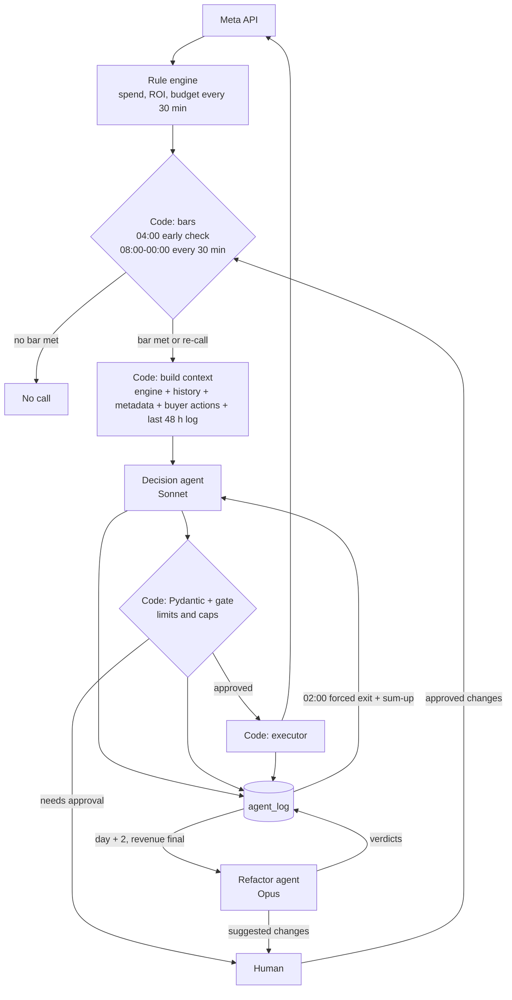
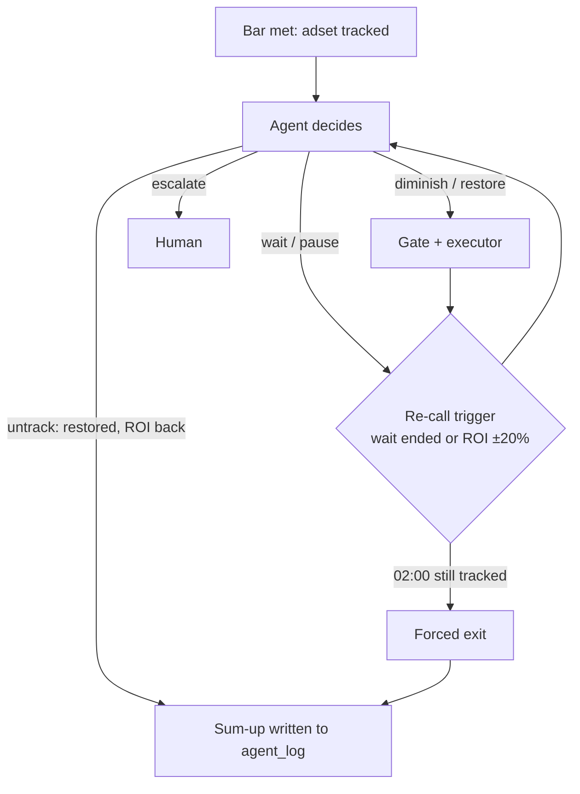

# ARCHITECTURE — Agent Army (POC)

> Status: draft, written section by section.

## 1. Agent topology

### One agent or many?

**Two LLM agents.** Everything else is plain code.

| Agent | When it runs | Sees | Does |
|---|---|---|---|
| **Decision agent** | Live, when an adset is flagged | One adset's current numbers and short history | Proposes an action for that adset, which is executed in code + logging changes |
| **Refactor agent** | Once a day | Past decisions and their results at day + 2, once revenue is final | Reviews those decisions and suggests rule adjustments or threshold changes |

Code handles the rest: flagging adsets, checking limits, calling the Meta API, logging, and the cost stop.

## 2. Decision boundaries

### The Decision Agent

##### Code invokes it; the agent never scans adsets on its own.
##### For starters, it can only hold up to 25% of each account's adsets, until proved safe and useful

- **First call:** by a very low ROI, age, and bad past yesterday. An adset is sent to the agent's supervision.

  Checked every 30 min from 08:00:
  - **New adset** (day 1–2): spend today ≥ **2 USD** AND ROI today ≤ **−20%**
  - **Aged adset** (day ≥ 3): spend today ≥ **3 USD** AND ROI today ≤ **−10%**

  **How the bar was set:** 4 candidate bars were compared on last week's data (all 6 accounts, `performance_scoped`, end-of-day values) by how much of the week's total loss (1,302 USD across all losing adset-days) falls on adset-days that meet the trigger. Query: [Task B/trigger_reach.py](../Task%20B/trigger_reach.py).
  - new 2 USD/−30%, aged 4 USD/−20%: ~21 first calls/day, 36% of loss reached
  - new 2 USD/−30%, aged 2 USD/−20%: ~30 first calls/day, 44%
  - **new 2 USD/−20%, aged 3 USD/−10% (chosen): ~32 first calls/day, 47%**
  - new 1 USD/−30%, aged 2 USD/−20%: ~70 first calls/day, 67%, but many calls on noisy 1 USD ROI

  "Reached" means the agent would look at the adset, not that the loss is saved. It counts the full day's loss, and end-of-day spend is higher than intraday spend, so real counts will be lower.

- **Morning rule (revenue lag):** from 08:00 to 12:00 the agent can only **wait**, **diminish (−15% or −20%)**, or **pause for up to 2 h**, after which the adset is re-sent to the agent to decide again. All actions are allowed from 12:00.
- **The agent receives the engine scan of adset performance:**

### Autonomous decisions it can do

| Action | Limit |
|---|---|
| **wait** | 2 or 4 h, no action, by agent's choice |
| **diminish** | −15% up to −40% in jumps of 5 of the current budget per action |
| **pause** | 2–4 h, or until tomorrow at most. Used on small or new adsets to see whether revenue comes in |
| **unpause / restore budget** | Up to the buyer's last budget, never above it |
| **untrack** | When the adset is restored and ROI is back. The agent logs whether it thinks it did well |
| **notify on sharks** | Tell a human when a shark's ROI drops |
**Sharks** (spend ≥ **50 USD/day**, old adsets): diminish and wait only. No pause.


### Needs human approval 
- Confidence < 0.6: the agent doesn't know, so it doesn't guess
- The action would break a daily cap (below)

### Forbidden

- **Killing any adset.** The longest the agent can pause is until tomorrow.
- Going above the buyer's last budget. The buyer's last change always stands.
- Touching bids, targeting or creatives. The agent changes the budget only.
- Unpausing an adset a human paused
- Touching other accounts

### Daily caps: 

| Cap | Value |
|---|---|
| Budget removed per account per day (diminish + pause) | ≤ account 25% daily cap |
| Budget changes per adset per day | ≤ 4   |

### Logging

Every decision goes into `agent_log` with the data log, action, amount, confidence and reasoning. On untrack, the agent also logs its own view of whether the intervention went well.

### Refactor agent: what it reviews

Runs once a day on day + 2, once revenue is final and adsets have another day of performance to compare.

1. **SQL stats** over all decision logs: hit rate, USD saved or lost, share of untracked adsets that recovered, lag revenue accumulated.
2. **Drill-down** on three interventions: the worst, the best, and one at random, with decision reasoning analysis.
3. **Output:** a verdict on each one (was the agent's self-assessment right?) and suggested rule or threshold adjustments.
## 3. Economics

**Sources:** first calls come from [Task B/trigger_reach.py](../Task%20B/trigger_reach.py) (`performance_scoped`, 7 days, 6 accounts). Prices are Anthropic list prices. Everything else is an assumption, marked below, to be measured.

### Calls per day (Decision agent, Sonnet 5)

| Input | Base | Hard | How |
|---|---|---|---|
| First calls | 32 | 48 | Script cell 1, chosen bar: 32/day average. Hard = ×1.5 busy-day factor, from the old bar's busiest day (31 vs 21 average); confirm with cell 2 |
| Re-calls per adset | 4 | 12 | Assumption from the Decision boundaries rules. Base: ~8 h left, re-check every 2–4 h, +1 ROI ±20% move. Hard: flagged at 08:00, 18 h to 02:00, re-check every 2 h (9) + 3 ROI moves |
| Closing call (02:00) | 1 per adset | 1 per adset | Decision boundaries: one untrack call per tracked adset |
| Retries | 0 | +5% | Assumption: failed Pydantic validation or API errors |
| **Calls/day** | 32 + 128 + 32 = **192** | (48 + 576 + 48) × 1.05 = **~655** | |

### Cost per call

Prices: Sonnet 5 2 USD/1M input, 10 USD/1M output (thinking is billed as output), cached input ~0.20 USD/1M.

| Part | Base tokens | Hard tokens | How |
|---|---|---|---|
| System prompt + few-shot | 2,000 cached → 0.0004 USD | 2,000 uncached → 0.004 USD | Estimate. Hard: calls spread across the day miss the 5-min cache |
| Adset context (see Data flow) | 800 → 0.0016 USD | 1,500 → 0.003 USD | Estimate. Hard: long buyer notes, last intervention |
| Output + thinking | 700 → 0.007 USD | 2,300 → 0.023 USD | Estimate: 200 JSON + 500 thinking; hard: 300 + 2,000 |
| **Per call** | **0.009 USD** | **0.030 USD** | |

### Per day

| | Base | Hard |
|---|---|---|
| Decision agent | 192 × 0.009 USD = 1.73 USD | 655 × 0.030 USD = 19.65 USD |
| Refactor agent (Opus 5: 5 USD/25 USD per 1M) | 10k in + 1.5k out = 0.09 USD | 50k in + 5k out = 0.38 USD |
| **Total** | **≈ 1.80 USD (6% of 30 USD)** | **≈ 20 USD (67% of 30 USD)** |

**Models:** code/SQL for triggers, gate, API calls, stats, cost stop; Sonnet for decisions; Opus for the daily review.
## 4. Failure modes
#### 1. Big losers missed or caught late
- Issue: a big adset at a mild negative ROI (e.g. 100 USD spend at −8%) loses real money but never hits the ROI trigger.
- Guardrail: add an early day trigger spend more than 50% and −50% ROI, checked every 30 min from 04:00.
#### 2. Losers left running
- Issue: the agent keeps choosing wait, or escalations sit in the human queue while the adset keeps spending.
- Guardrail: at most 2 waits in a row, then act or escalate; an escalation not handled in 2 h becomes an automatic diminish.
#### 3. Winners cut because of revenue lag
- Issue: today's revenue arrives late, so a good adset looks like a loser and gets cut.
- Guardrail: the morning rule, hours_into_day in the context, no kills, pauses end by tomorrow at the latest.
#### 4. Call storm from data mismatch

- Issue: mixed 14- and 18-digit ids or stale data break tracking, so the same adset re-triggers every 30 min.
- Guardrail: normalize ids, a data-freshness check, at most 6 calls per adset per day, and the 30 USD stop.
#### 5. Shrinking spend for better ROI

- Issue: the agent cuts so much that ROI looks good while spend and profit fall.
- Guardrail: at most 25% of each account's adsets tracked, the daily cap on budget removed, restores up to the buyer's budget, ≤ 4 changes per adset per day. Can't pause sharks.

## 5. Data flow

### When the agent is launched

The existing rule engine pulls spend, ROI and budget from Meta every 30 min. Code checks the bars on that data and launches the Decision agent only for adsets that meet one. The agent never pulls data itself.

| Time | Check | Bar |
|---|---|---|
| **04:00**, once | Special early check (fast burners) | spend today ≥ **50% of budget** AND ROI today ≤ **−50%** |
| **08:00–00:00**, every 30 min | First-call bars | New (day 1–2): spend ≥ **2 USD** AND ROI ≤ **−20%**<br>Aged (day ≥ 3): spend ≥ **3 USD** AND ROI ≤ **−10%** |
| **08:00–00:00**, every 30 min, adsets already tracked | Re-call | The wait the agent set has ended, or ROI moved more than ±20% since the last decision |
| **02:00**, once | Forced exit + sum-up | One call per adset still tracked: forced untrack and self-assessment |

### Decision agent: what it gets on each call

No tool use. Code builds the whole context before the call, so each decision is a single request with a fixed, countable size. Raw tables never reach the model.

**New data table: `agent_log`.** It holds one row per agent call: the trigger, the context the agent saw, its decision and reasoning, the gate verdict, the budget change on Meta, and the call cost. It is used to know which adsets are tracked, to give the agent its last 48 h on the same adset, to enforce the 30 USD stop, and to let the Refactor agent review decisions on day + 2.

**Fixed part (same on every call, cached):** system prompt + 3 few-shot cases (hiccup → wait, trend → diminish, conflicting signals → escalate).

**Per-adset part: 3 JSON blocks**

| Block | Fields | Source |
|---|---|---|
| **1. Engine now + history** | `roi_now`, `spend_now`, `fb_budget`, `buyer_budget` (the cap), `hours_into_day`; last 7 days of `spend`, `revenue`, `profit`, `roi`, `conversions`, one row per day | Rule engine check (live); `performance` (cached daily) |
| **2. Metadata** | `bid_strategy`, `roas_target`, `daily_budget`, `spend_day_no` (age), `geo`, `effective_status` | `campaign_adset_metadata` (cached daily) |
| **3. History** | Buyer actions in the last 24 h (old → new budget, note); the last agent intervention on this adset in the last 48 h (actions and summary assessment) | `buyer_actions`, `agent_log` (queried on demand) |

**Added by code:**
- `data_quality_flags`: revenue not final, blank ids, missing metadata, no spend history
- `is_shark`
- `allowed_actions` and limits for this adset (e.g. no pause on a shark, changes left today), so the agent can't propose something the gate will block

### Decision agent: output (Pydantic)

```
action: wait | diminish | pause | unpause | untrack | escalate
amount_pct: float | None       # diminish / restore
hours: 1 | 2 | 4 | None        # wait / pause
confidence: float 0–1
reasoning: str                 # ≤ 60 words
data_quality_flags: list[str]
self_assessment: str | None    # only on untrack
```

Code validates the output with Pydantic, then the gate checks it against the Decision boundaries before anything runs.

### Buyer actions: how they're used, and the risks

- **Used as context.** They show the buyer's last budget (the cap) and whether a buyer touched the adset recently. 
- **Notes are optional and mostly blank.** Missing notes mean no information, not "no reason".
- **Notes are data, not instructions.** The prompt says so, so a note can't steer the agent.

### Size per call (estimate, to measure)

| Part | Tokens |
|---|---|
| System prompt + few-shot (cached) | ~2,000 |
| Per-adset context | ~800 |
| Output | ~200 |

The output is saved in the new `agent_log` table.

### Refactor agent: data flow

- **When:** once a day, on day + 2, when that day's revenue is final.
- **Gets (built by SQL, no raw tables):**
  - Stats over all `agent_log` rows of that day: calls, hit rate, USD saved or lost vs no action, share of adsets that recovered, LLM cost.
  - 3 drill-down cases (worst, best, one random): the context the agent saw, its decisions and reasoning, its self-assessment, and the final day + 2 profit.
  - Its own reports from the last 7 days, so it sees trends and doesn't repeat the same suggestion.
- **Delivers:**
  - A verdict per case (right / wrong / unclear, and why), written back to `agent_log`.
  - A short report with up to 3 suggested bar or rule changes, saved as a daily report.
- **Accumulates:** yes. Verdicts stay on `agent_log` and reports pile up day by day, so a suggestion is only made when the same pattern shows up across several days. A human approves any change before it reaches the bars or the prompt.

### Full flow



### Agent loop (one adset)

1. **Enter:** a bar is met, and the adset starts being tracked.
2. **Decide:** the agent chooses wait, diminish, pause, unpause/restore or escalate.
3. **Re-call:** when the wait or pause ends, or ROI moves more than ±20%, the agent decides again with the new numbers.
4. **Exit:** the agent untracks the adset when it is restored and ROI is back. On exit it writes a sum-up to `agent_log`: what it did, and whether it thinks it went well.
5. **Forced exit:** any adset still tracked at 02:00 is untracked by code, and the agent writes the same sum-up. No adset carries over to the next day.


